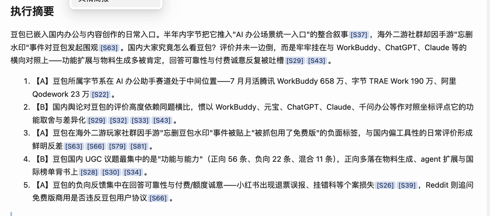

<p align="center">
  
</p>

<p align="center">
  面向运营与产品经理的 AI 市场调研工作台<br>
  需求澄清 · 计划可改 · 分阶段执行 · 可追溯证据 · 报告与经验复用
</p>

<p align="center">
  <a href="LICENSE"></a>
  
  
  
  
</p>

<p align="center">
  <a href="#30-秒看懂">30 秒看懂</a> ·
  <a href="#快速开始">快速开始</a> ·
  <a href="#当前进度">当前进度</a> ·
  <a href="#项目结构">项目结构</a> ·
  <a href="#一次调研如何完成">完整流程</a> ·
  <a href="#系统架构">系统架构</a>
</p>

## 30 秒看懂

报告里的每一句结论都带角标。点开角标是一张**证据卡**——平台、体裁、可靠度等级、五维评分、打分理由、抓取时间，再点一下回到原帖：



<!--
  演示视频（2 分 53 秒，中英双语字幕）：
  把 owli-demo-2m53s.mp4 拖进 GitHub 网页版的 README 编辑器（或任意 issue 输入框），
  GitHub 会返回一条 https://github.com/user-attachments/assets/xxxx 的链接，
  把那条链接单独一行贴在下面，README 里就会渲染成可播放的播放器。
  注意：视频不要提交进仓库；免费账号单个视频上限 10MB，压好的文件是 8.5MB。
-->

> 完整演示：**[2 分 53 秒 · 从提问到出报告](https://github.com/user-attachments/assets/e105a011-c6f5-4115-a6f5-b1cd6b8267fb)**<!-- 换成 user-attachments 链接 -->
> 更长的无剪辑全流程录屏见 [一镜到底无人托管Agents舆情监督工具](https://weixin.qq.com/sph/A1FeZR2wL)。
> 文字版实录：[公众号文章](https://mp.weixin.qq.com/s/kGCSCmHF8XHaEYS1t4O2nw)<!-- 换成 mp.weixin.qq.com 那篇的链接 -->

### 为什么做这个

调研是很多产品创造、内容生产和决策的第一步。在实际用下来的 AI 调研工具里，有两个问题反复出现：

1. **无法验证信息源的可靠度。** 报告写得很顺，但你没法追问：这个「多数用户认为」是多少人？哪来的？
2. **流程没法人工暂停和干预，一跑还很久。** 提交之后只能干等，发现方向不对也插不上手。

这两句写在需求文档的最前面，整个工具是照着它们倒推出来的。

## 当前进度

本仓库是**代码仓（公开，MIT）**，产品设计与需求文档在另一个私有仓库。当前处于 **M0 骨架切片之后的迭代期**：

- **2026-09-06** 第一份完整报告验收通过。之后增加了「正式稿（咨询体）」这一层，把原始工作稿整理成可以直接给客户读的报告；另外做了 UGC（用户原帖与评论）编码进主链路、按 goal 分配信息源、公众号接入。
- **2026-09-13** 最新一份成品《国内大家对豆包的看法》（fast 档）：**18 章、1,128 条证据、执行 3 小时 37 分、模型费约 21 美元**。其中 80 条进入引用池，正文实际引用 28 条。
- **进行中**：standard 档重采一轮，题面加了四家竞品作对照；报告口径修正包（RPT-4）开工中。

> 演示视频和 GIF 出自 09-13 那一轮；此后 main 又前进了几十个提交，现在拉下来的代码比出那份报告时更新。

| 能力 | 状态 | 说明 |
|---|---|---|
| 证据可追溯 | ✅ | 结论 → 角标 → 证据卡（平台/体裁/A·B·C 等级/五维评分/打分理由/抓取时间）→ 原帖链接 |
| 采、审、写分离 | ✅ | 抓取 Agent 只负责采；可靠度审计由独立 Agent 逐条打分；撰写在最后，不给自己的证据打分 |
| 自报证据缺口 | ✅ | 报告单列「证据缺口」与超时未完成项；孤证自动带「尚待其他来源印证」 |
| 采到未引用留档 | ✅ | 未进引用的证据不丢弃，单列一栏可自行翻查 |
| 计划闸门 | ✅ | 计划需用户批准才冻结开跑；每个 Goal 完成后是一个决策点，可继续 / 补采 / 改向 |
| 过程展示与日志 | ✅ | 工作板同屏显示 Goal 进度、调用次数与花销、证据表；运行面板保留每次调用的输入输出、耗时与重试 |
| 预算上限 | ✅ | 按金额设上限，到顶即停 |
| 正式稿（咨询体） | ✅ | 在工作稿之上再整理一层，可直接给客户读 |
| 导出 Excel / 推送飞书 | ✅ | Excel 6 sheet（`openpyxl`）；飞书导出可选，另需 `lark-cli` |
| 多专家制订计划 | 📋 计划中 | 目前是单方案直出，不渲染对比视图 |

## 快速开始

需要 Python 3.9+、Node.js、以及支持 `STRICT` 表的 SQLite 3.37+。

```bash
git clone https://github.com/S313S/Owli.git && cd Owli

# 1. 后端
python3 -m venv .venv && source .venv/bin/activate
python -m pip install -r requirements.txt

# 2. 前端（web/dist 不进版本库，不构建的话页面路由会全 404）
cd web && npm install && npm run build && cd ..

# 3. 凭证（注意是 ~/.owli/.env，不是仓库里的 .env）
mkdir -p ~/.owli && cp .env.example ~/.owli/.env   # 然后按注释填

# 4. 起服务
python -m uvicorn app.api.main:app --host 127.0.0.1 --port 8721 --workers 1
```

打开 <http://127.0.0.1:8721/api/health>，**先确认 `engines` 字段里两个引擎都是 ok 再建研究**。
引擎缺失不会拦住启动，只会在建完研究后把状态变成「引擎不可用」。

服务启动时会初始化 `var/owli.db` 并校验 schema；实际表或列与 `app/store/schema.sql` 不一致时会拒绝启动。

### 两个引擎怎么准备

执行层是双引擎的，两边都得能用，否则计划建得出来、研究跑不动。

| 引擎 | 负责 | 怎么准备 |
|---|---|---|
| **Claude**（`claude-agent-sdk`） | 规划、评级、交叉验证、撰写 | 本机 Claude Code 能正常登录即可 |
| **Codex** | 采集、数据清洗、Excel | 装好 `codex` CLI，并把凭证放进隔离目录：<br>`mkdir -p ~/.owli/codex_home`<br>`ln -s ~/.codex/auth.json ~/.owli/codex_home/auth.json`<br>默认走订阅登录；改用 API key 时才需要 `OPENAI_API_KEY` |

运行期的 `CODEX_HOME` 默认是 `~/.owli/codex_home`，可用 `OWLI_CODEX_HOME` 覆盖。
（仓库里的 `scripts/owli-codex.sh` 是**开发期**启动器，给用 Codex 写 Owli 代码的人用，
隔离目录是 `~/.owli/codex_home_dev`，跑产品时不经过它。）

### 信息源与凭证

| 源 | 需要 | 备注 |
|---|---|---|
| 小红书 · 抖音 | `TIKHUB_API_KEY` | |
| Reddit | `PROWLO_API_KEY` | `APIFY_TOKEN` 兜底，可选 |
| X / Twitter | `X_BEARER_TOKEN` | |
| Product Hunt | `PRODUCT_HUNT_TOKEN` | |
| Hacker News | — | 不需要 key |
| 网页检索 | `EXA_API_KEY` 或 `TAVILY_API_KEY`（至少一个） | `SERPER_API_KEY` 走 Google，默认关，`OWLI_WEB_SEARCH_GOOGLE=1` 才启用 |
| **微博 · 公众号** | **离线预采集数据** | **不是配个 key 就能用**：读 `~/.owli/precollect/` 下的数据，需先用 MediaCrawler 或影刀在本机采好（公众号还要人在场处理登录和验证码）。没有这批数据时这两个源会返回空 |

完整键名见 [`.env.example`](.env.example)。凭证一律不进仓库。

## 项目结构

```
Owli/
├── app/                Python 后端（单进程 FastAPI，端口 8721）
│   ├── api/            路由、SSE、幂等、事件缓冲
│   ├── orchestrator/   计划执行、依赖调度、状态机、重试与总闸
│   ├── adapters/       引擎适配：claude · codex · events · ratelimit · validation · selfcheck
│   ├── sources/        xhs · douyin · weibo · reddit · x · hn · product_hunt · web_search · wechat_mp
│   ├── store/          schema.sql · dao.py（固定写入接口）· recall.py（FTS5）
│   ├── report/         markdown 成稿 + excel.py（openpyxl 6 sheet）
│   └── prompts/        公共前缀 + 各 agent 模板
├── web/                前端 React + Vite + Ant Design（SPA）
├── scripts/            开发工具脚本
├── runs/               ⛔ 不入库 · 产物目录 <research_id>/goals/goal-N/
└── var/                ⛔ 不入库 · owli.db · logs/
```

`runs/` 的路径结构是契约，不是随手放的目录。详见 [`AGENTS.md`](AGENTS.md)。

## 项目概述

Owli（Owl + Sight）把一次调研组织成可暂停、可干预、可核验、可复用的完整流程：

> **说清要调研什么 → 制订计划并交用户核对 → Goal / Agent 分阶段执行 → 证据可靠度评估 → 生成可核验报告 → 沉淀为下一次可复用的经验。**

首先服务两类高频场景：

- **品牌社交媒体洞察**：识别竞品账号、内容策略、热门内容和用户反馈。
- **竞品产品洞察**：整理竞品能力、优缺点、官网信息与客户评论，辅助产品决策。

Owli 借鉴多 Agent 调研项目的协作思路，但不 fork BettaFish；目标是针对"来源是否可信、为什么这样判断、过程中能否干预、研究经验如何复用"等问题重新设计。

## 核心用例

[](docs/assets/readme/core-use-cases-cn.png)

## Owli 有什么不同

1. **信息源可追溯**：报告结论绑定来源、作者、时间、采集方式和可靠度理由。
2. **决策天平**：计划确认前动态追问用户的目标、取舍和判断依据，而不是直接替用户猜。
3. **阶段化人工干预**：计划核对和每个 Goal 完成后均可暂停、确认、调整或停止，并记录变更原因。
4. **Claude + Codex 双引擎**：统一编排但保留能力差异；规划、审计与报告偏向 Claude，代码、抓取与沙箱执行偏向 Codex。
5. **报告与经验复用**：沉淀报告、证据、反馈、标签和运行方式；下一次相似需求先询问是否复用。
6. **多专家制订计划**（计划中）：不同模型分别设计调研 Goal 与路径，再统一评估形成最终计划。

## 产品价值闭环

[](docs/assets/readme/product-value-loop-cn.png)

产品的重点不是"自动写一份报告"，而是把**用户判断、Agent 协作、可追溯证据与历史复用**连接成可重复的调研闭环。

## 一次调研如何完成

[](docs/assets/readme/core-business-swimlane-cn.png)

泳道图按五类角色和八个阶段组织：

| 角色 | 主要职责 |
|---|---|
| 用户 | 提出问题、确认是否复用历史、核对计划、验收报告、决定沉淀内容 |
| Web 工作板 | 展示历史候选与最终计划，提供实时进度、干预入口、阶段预览和报告预览 |
| Goal Agent / 编排层 | 建立决策上下文、语义检索、评估计划、固化执行规格、并发调度和报告组装 |
| 执行引擎 SubAgents | 制订方案、动态执行 Goal、进行可靠度审计和按反馈修订 |
| 数据与沉淀 | 保存历史报告、变更日志、信息源、`EvidenceRecord`、`ResearchReport` 与检索索引 |

橙色节点是人工干预，虚线表示反馈和复用；命中历史记录时只进入计划核对，不直接沿用旧结论执行。

## 系统架构


| 系统边界 | 包含什么 | 负责什么 |
|---|---|---|
| 浏览器工作台 | 需求与计划、进度与干预、报告与经验库 | 用户交互与结果呈现 |
| 本地 Owli | 应用编排、Agent 引擎适配、证据与产物、Agent 执行区 | 控制、事件、留痕、校验与复用 |
| 外部服务 | Claude、Codex、网页搜索、平台信息源 | 提供模型能力与外部信息 |

架构坚持五类路径分离：`控制`、`事件`、`证据&信息`、`产物`、`复用`。公共任务接口只对齐必要能力，不强行抹平 Claude 与 Codex 的差异。

Owli 跑在本地：调研题目和采集到的数据不出本机，用的是使用者自己的模型额度。

## 参与开发

进仓库先读 [`AGENTS.md`](AGENTS.md)——里面有八条开发期硬约束，每条都是实测踩出来的：

- **退出码不可信。** 三终端实测：Claude 中断返回 0，Codex 语义失败和越权也返回 0。任务成败判定 = 产物按协议落盘并通过校验 + 结构化结论可解析。
- **验收标准必须可判定。** 不写「做得好」，要写「6 个 sheet 齐全且命名顺序正确」这类能用代码断言的条件。
- **不在编排层写引擎分支。** `app/orchestrator/` 里出现 `if engine ==` 就是架构走形。
- **不给 agent 裸 SQL 通道**，**凭证不进工作树**，**可写路径白名单收敛到 `runs/<research_id>/goals/goal-N/`**。

## 适用边界

演示里那次调研的样本全部来自社交平台的用户评论，缺少官方定位、功能边界与定价页面——报告自己也写明了这一点。这类产出适合发现线索、设计下一轮采集，**不适合据此估算市场占比或满意度**。演示中出现的具体产品名只是样例问题，不构成对该产品的评价。

## 许可

[MIT](LICENSE)

---

<p align="center">Owli · Owl + Sight · 让市场调研的每一步都有依据</p>
