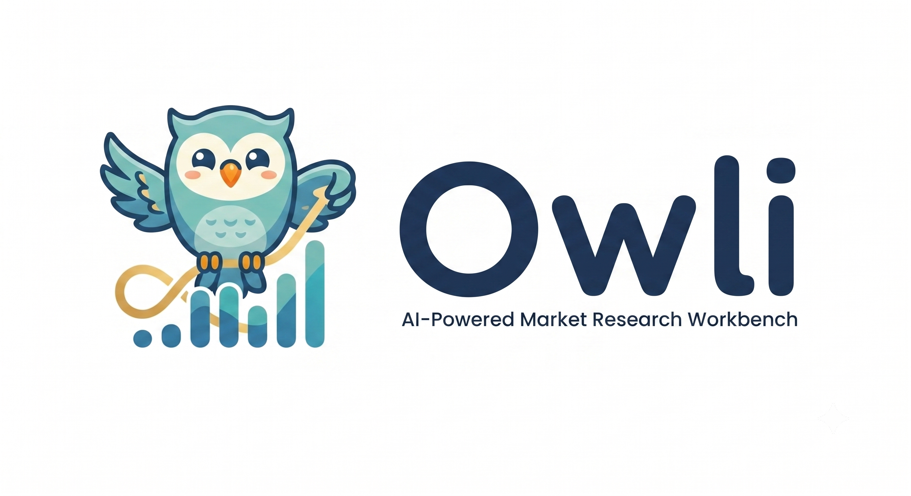
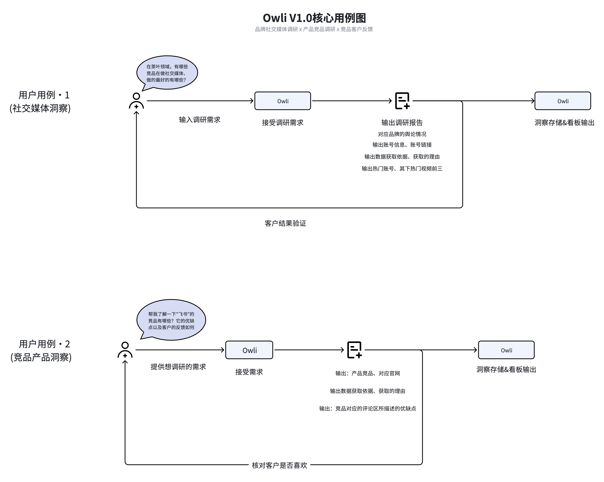
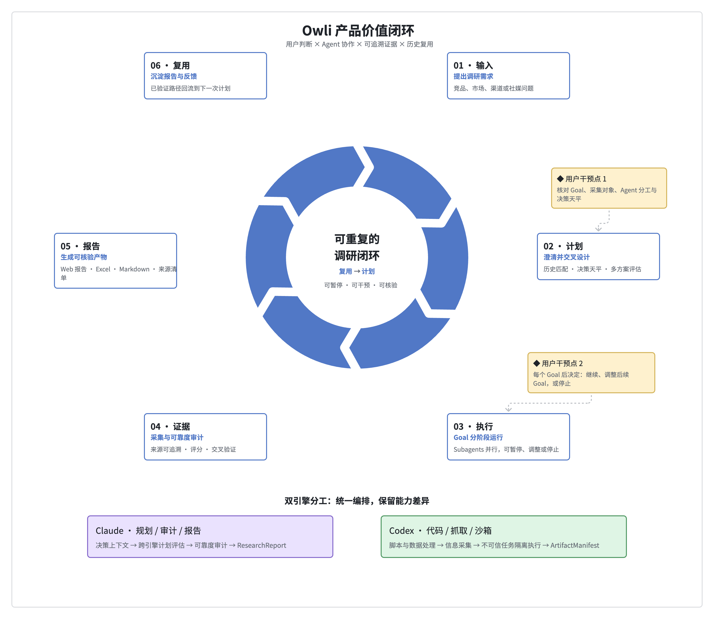
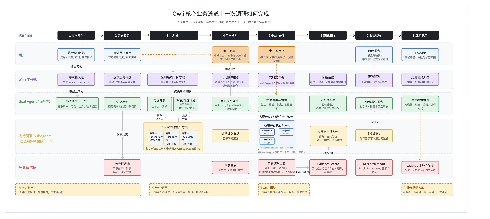
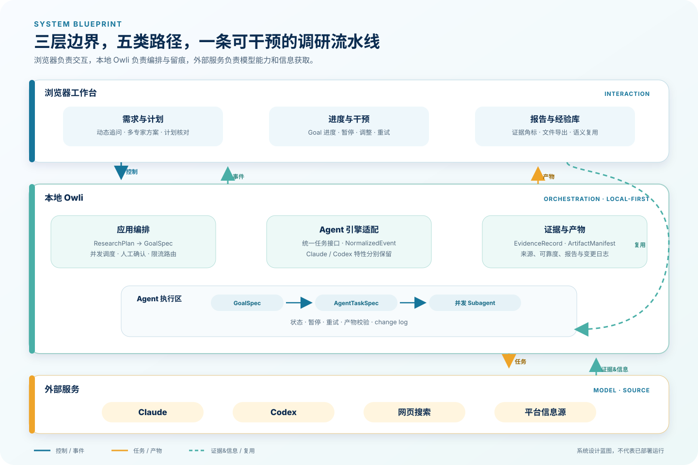

  

  面向运营与产品经理的 AI 市场调研工作台 
  需求澄清 · 多专家计划 · 双引擎执行 · 可追溯证据 · 报告与经验复用

  <a href="#项目概述">项目概述</a> ·
  <a href="#核心用例">核心用例</a> ·
  <a href="#产品价值闭环">价值闭环</a> ·
  <a href="#一次调研如何完成">完整流程</a> ·
  <a href="#系统架构">系统架构</a>

> [!IMPORTANT]
> **Owli 目前处于产品设计与早期实现阶段。** 页面中的流程和架构为产品设计目标，并非已上线系统截图。

## 项目概述

Owli（Owl + Sight）是一个面向运营和产品经理的 AI 市场调研工作台。它把一次调研组织成可暂停、可干预、可核验、可复用的完整流程：

> **说清要调研什么 → 多专家跨引擎制订计划 → Goal / Agent 分阶段执行 → 证据可靠度评估 → 生成可核验报告 → 沉淀为下一次可复用的经验。**

Owli 首先服务两类高频场景：

- **品牌社交媒体洞察**：识别竞品账号、内容策略、热门内容和用户反馈。
- **竞品产品洞察**：整理竞品能力、优缺点、官网信息与客户评论，辅助产品决策。

Owli 借鉴多 Agent 调研项目的协作思路，但不 fork BettaFish；目标是针对“来源是否可信、为什么这样判断、过程中能否干预、研究经验如何复用”等问题重新设计。

## 核心用例

> 上图描述 V1.0 的目标用例与验收方向；报告内容、看板存储和反馈闭环仍待正式产品实现。

## Owli 有什么不同

1. **信息源可追溯**：报告结论绑定来源、作者、时间、采集方式和可靠度理由。
2. **决策天平**：计划确认前动态追问用户的目标、取舍和判断依据，而不是直接替用户猜。
3. **多专家制订计划**：不同模型分别设计调研 Goal 与路径，再统一评估形成最终计划。
4. **Claude + Codex 双引擎**：统一编排但保留能力差异；规划、审计与报告偏向 Claude，代码、抓取与沙箱执行偏向 Codex。
5. **阶段化人工干预**：计划核对和每个 Goal 完成后均可暂停、确认、调整或停止，并记录变更原因。
6. **报告与经验复用**：沉淀报告、证据、反馈、标签和运行方式；下一次相似需求先询问是否复用。

## 产品价值闭环

产品的重点不是“自动写一份报告”，而是把**用户判断、Agent 协作、可追溯证据与历史复用**连接成可重复的调研闭环。

## 一次调研如何完成

泳道图按五类角色和八个阶段组织：

| 角色 | 主要职责 |
|---|---|
| 用户 | 提出问题、确认是否复用历史、核对计划、验收报告、决定沉淀内容 |
| Web 工作板 | 展示历史候选与最终计划，提供实时进度、干预入口、阶段预览和报告预览 |
| Goal Agent / 编排层 | 建立决策上下文、语义检索、评估计划、固化执行规格、并发调度和报告组装 |
| 执行引擎 SubAgents | 多专家并行制订方案、动态执行 Goal、进行可靠度审计和按反馈修订 |
| 数据与沉淀 | 保存历史报告、变更日志、信息源、`EvidenceRecord`、`ResearchReport` 与检索索引 |

橙色节点是人工干预，虚线表示反馈和复用；命中历史记录时只进入计划核对，不直接沿用旧结论执行。

## 系统架构

| 系统边界 | 包含什么 | 负责什么 |
|---|---|---|
| 浏览器工作台 | 需求与计划、进度与干预、报告与经验库 | 用户交互与结果呈现 |
| 本地 Owli | 应用编排、Agent 引擎适配、证据与产物、Agent 执行区 | 控制、事件、留痕、校验与复用 |
| 外部服务 | Claude、Codex、网页搜索、平台信息源 | 提供模型能力与外部信息 |

架构坚持五类路径分离：`控制`、`事件`、`证据&信息`、`产物`、`复用`。公共任务接口只对齐必要能力，不强行抹平 Claude 与 Codex 的差异。

## 经过验证的技术方案

Owli 使用 Claude 与 Codex 协作完成不同类型的调研任务，并保留两种引擎各自擅长的能力：

- **统一任务协议**：同一份任务规格可以交给不同引擎执行，编排层只依赖必要的公共能力。
- **按能力分工**：规划、审计与报告组织偏向 Claude；代码、信息采集与沙箱任务偏向 Codex。
- **结果可核验**：任务完成以结构化结论和实际产物为准，报告中的关键判断可以回到原始来源。
- **过程可控制**：计划确认与阶段完成时均可暂停、调整或继续，用户判断始终保留在调研流程中。

这些结论已经过最小方案验证；完整产品功能仍在逐步实现中。

---

Owli · Owl + Sight · 让市场调研的每一步都有依据

